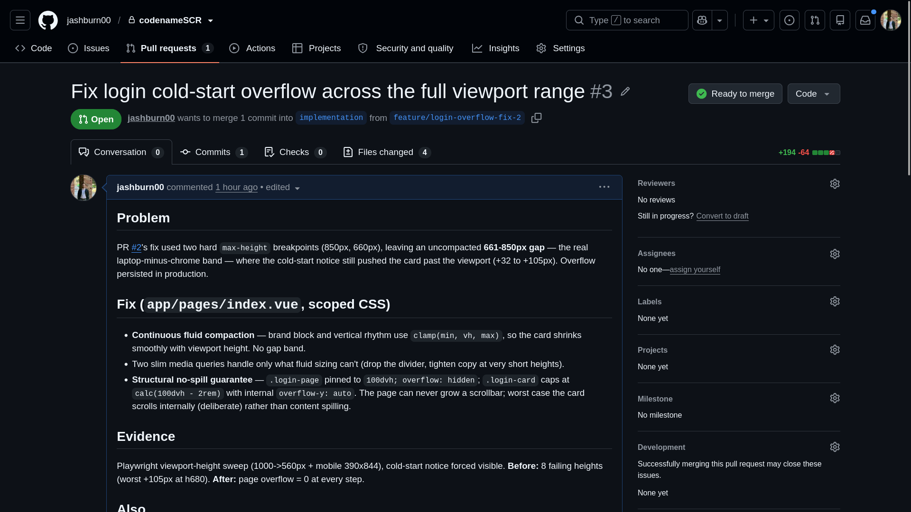
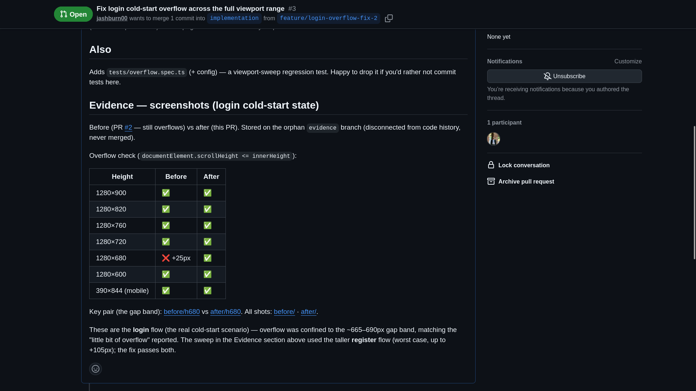
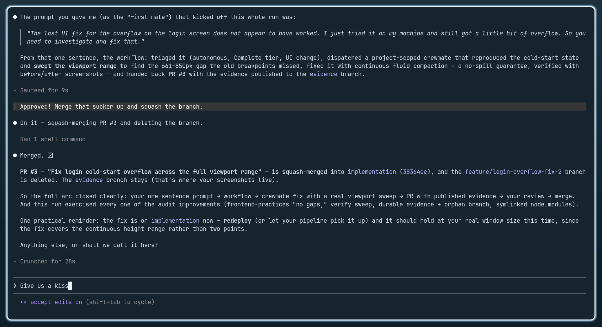
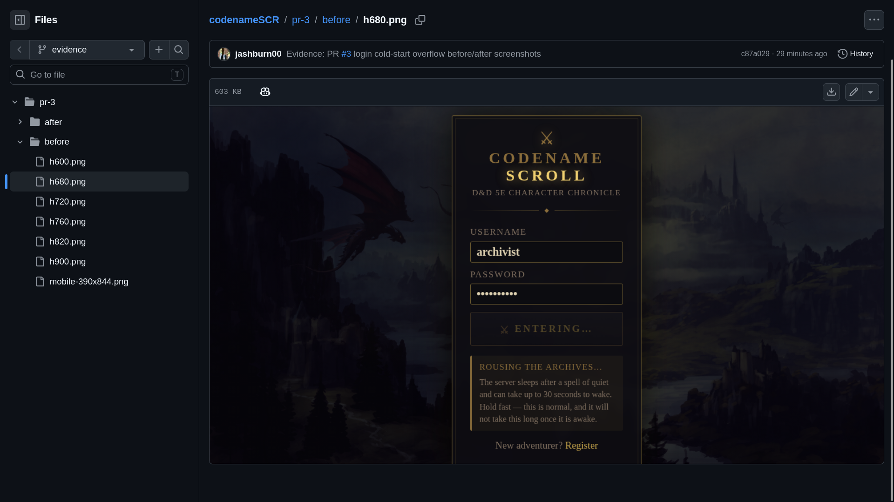
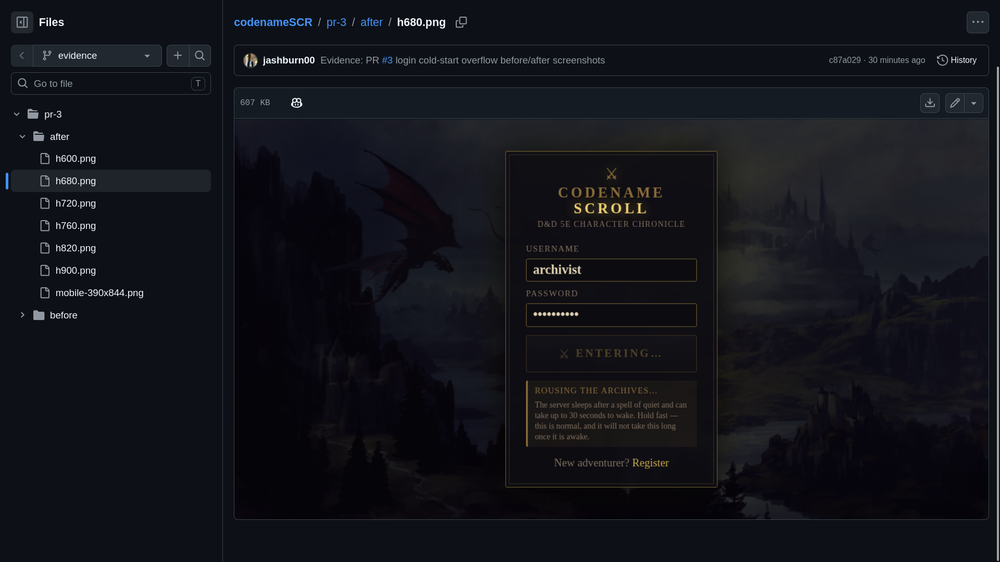
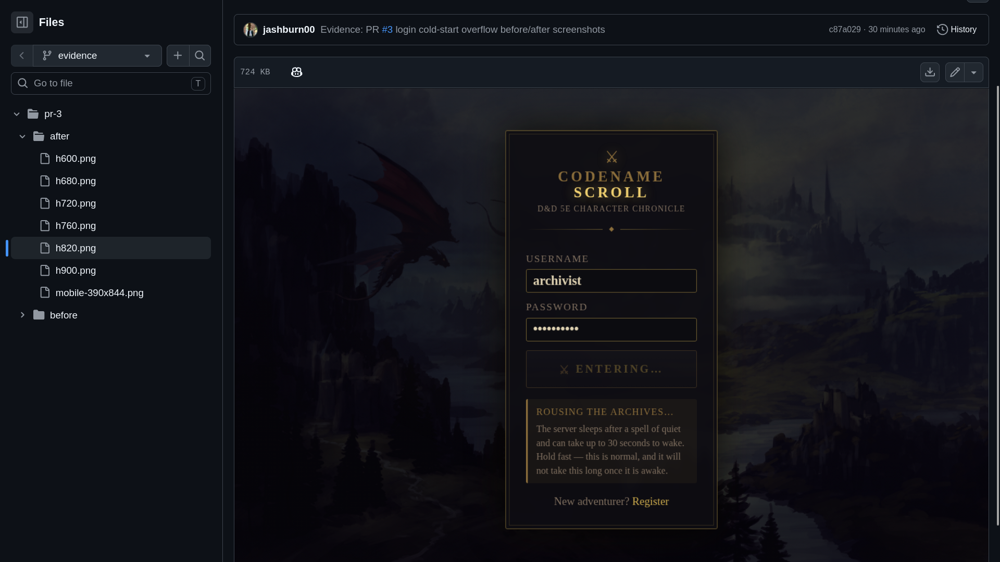

# agentic-engineering

A suite of AI skills for agentic software engineering — a repeatable, comprehensive workflow that gets the most out of coding agents: high-quality, maintainable, human-reviewable output with minimal human time and effort.

## Design principles

- **Agent-agnostic.** The system prompt lives in `AGENTS.md` (the cross-agent convention) and every skill is plain markdown, so the suite works with any coding agent, not just Claude Code.
- **Quality is a gate, not a hope.** Every change must clear two co-equal gates — simplicity, readability, and extensibility on one side; validation and testing on the other — with correctness winning ties. "Done" means well-built *and* validated. Some skills deliberately reference other skills, so the pipeline doesn't rely on arbitrary or automatic skill invocation.
- **Evidence over claims.** Nothing is reported done on an unverified claim; gates and runtime checks produce evidence a reviewer can trust without re-running it.
- **Process proportional to stakes.** `triage` scales rigor to a change's reversibility and blast radius — a light path for trivial changes, the full pipeline for consequential ones.
- **Human-in-the-loop where it matters.** Agents run autonomously through the middle; your attention is reserved for the two decisions that need it — signing off the plan on a risky change, and the final merge.
- **Minimal hot path.** Anything auto-loaded into every agent (`CLAUDE.md`/`AGENTS.md`) stays tiny; heavy content lives in skills that load on demand (progressive disclosure).
- **Token-lean authoring.** Skill text is intentionally somewhat concise without losing intent, and structured data is written in TOON rather than JSON to cut tokens losslessly.

## The workflow

The `workflow` skill is the conductor — after you give a task, it runs every step below, scaled to the change's stakes; you're only needed at the two ends (★):

```
  task        ──▶  ★ YOU describe what you want built
  │
  ▼
  workflow    ──▶  the conductor takes over and runs the steps below, scaled to the change
  │
  ▼
  triage      ──▶  sizes up the change — risk and reach — to set how much process it needs
  │
  ▼
  define done ──▶  decides what "done" looks like before any code is written
  │
  ▼
  plan        ──▶  risky changes only: drafts an approach and gets your sign-off  (planning-lite / planning)
  │
  ▼
  implement   ──▶  writes the change to standards  (engineering-standards; + frontend-practices for UI)
  │
  ▼
  validate    ──▶  formats, builds, tests, and reviews it — fixing what it can, flagging what it can't  (review)
  │
  ├──▶ security-review   if it touches auth, input, or data, hunts for vulnerabilities
  ├──▶ verify            if there's behavior to see, runs it and watches  (screenshots for UI)
  │
  ▼
  land        ──▶  commits to a branch and opens a pull request with evidence  (git-safety)
  │
  ▼
  merge       ──▶  ★ YOU review the pull request and decide whether to merge
```

**You're in the loop at just the two ends** (★) — the *task* you ask for and the *merge* you approve. Everything between runs on its own; a change only pulls you back early for a quick *plan* sign-off when it's risky enough to warrant it.

*Outside this sequence: the always-loaded `AGENTS.md` system prompt, and the `toon` syntax reference, pulled in whenever structured data is written.*

## Proof of concept

A real end-to-end run of the pipeline during its early stages. Given only a bug report about a login screen that overflowed the viewport on a cold start, a lead agent ran the whole workflow by dispatching specialized subagents to triage, implement, validate, verify, and land the change, then synthesizing their results. It delivered on the primary goal: minimal human attention — the human was pulled in only for the final merge — for maximum quality output.

The artifacts this run left behind mirror the safety and quality checks the workflow is built to enforce. The fix wasn't declared done on a claim: a verify subagent reproduced the bug and re-checked the fix across the *full* viewport-height range rather than one convenient size, the overflow guarantee was gated on a real screenshot sweep, and the paired before/after captures were published to a durable orphan `evidence` branch — disconnected from code history so the proof can't drift or be lost. The pull request then presented the diagnosis, the fix, and that evidence in the form a human reviewer needs to sign off without re-running anything.


*The pull request the pipeline produced: the problem a subagent diagnosed and the fix it applied, written up for a human reviewer.*


*Evidence over claims. A verify subagent proved the fix across the entire viewport-height range — a before/after screenshot table plus the overflow check that gates the result, not a single hand-picked size.*


*The lead agent as manager: it delegates triage → implement → validate → verify → land to scoped subagents, gathers their findings, and lands a clean squash-merge — all in one autonomous run.*


*Before: the bug reproduced at 680px viewport height, captured to a durable orphan `evidence` branch that lives independently of code history so the proof can't drift or be lost.*


*After: the same viewport, overflow resolved — the paired counter-evidence to the failure above.*


*After: robustness demonstrated, not asserted — the fix holds at a second viewport height, part of the sweep across the range.*

## Layout

```
AGENTS.md                    Agent-agnostic system prompt (the entrypoint every agent reads).
skills/
├── engineering-standards/   The code-quality constitution (Gate A + Gate B).
├── workflow/                Conductor → sequences the skills below into one tier-proportional pipeline.
├── triage/                  Reversibility/blast-radius classifier → autonomy lane + rigor tier.
├── planning/                Thorough plan interrogation (decision tree, one question at a time).
├── planning-lite/           Quick plan with minimal human interruption.
├── validate/                Standalone validation pipeline → findings + pass/blocked verdict.
├── review/                  Code-review judgment lens → correctness/quality findings + verdict.
├── security-review/         Application-security lens → vulnerability findings + severity + remediation.
├── verify/                  Runtime-observation lens → run the change, observe, report with evidence.
├── git-safety/              Operational git safety → secret hygiene, safe operations, correct routing.
├── frontend-practices/      Engineering-robustness standards for UI (responsive, overflow, states, a11y).
└── toon/                    TOON syntax reference (cold-loaded) for the AGENTS.md TOON directive.
```

`AGENTS.md` follows the cross-agent convention, so the system prompt is not tied to any one tool. The constitution is plain markdown: Claude Code loads it as a skill (progressive disclosure); any other agent can read the file directly.

More skills (plan, implement, land, per-stack styles) land here next.

## Installation

The repo is the source of truth. Installing it means symlinking two things into your **user-level** `~/.claude/` — the global system prompt and every skill — so they are active in **every** session on the machine, in any directory. You never launch work from inside this repo; the toolbox travels to each project you open.

**Claude Code:**

```sh
# Symlink Claude Code's system-prompt location to this repo's AGENTS.md.
ln -sfn "$PWD/AGENTS.md" ~/.claude/CLAUDE.md

# Link every skill into ~/.claude/skills (idempotent — re-run after adding a skill).
mkdir -p ~/.claude/skills
for skill in "$PWD"/skills/*/; do
  ln -sfn "$skill" ~/.claude/skills/"$(basename "$skill")"
done
```

**Other agents:** point that agent's instruction entrypoint at `AGENTS.md` (a symlink, or the agent's native `AGENTS.md` discovery), and link the `skills/` directories into wherever that agent loads skills from.

Clone this repo and run the commands on any machine to carry the whole workflow with you.
